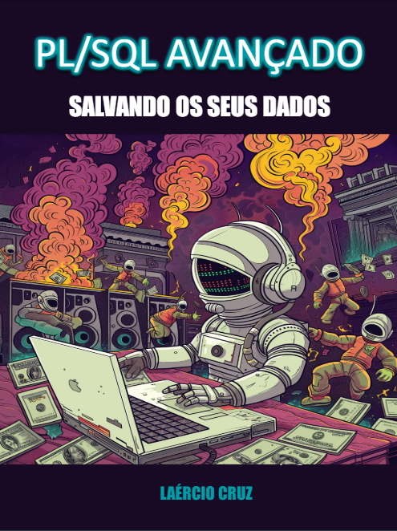

    

-------

# Projeto EBOOK Gerado por I.A.s

 > ℹ️ **NOTE:** Este é o repositório desenvolvido durante o curso de IA na plataforma da [DIO](https://dio.me)

Projeto com o objetivo de gerar um ebook digital com as facilidades das ferramentas de IA. todos os prompts
seguem abaixo.

<a href="https://github.com/laerciocruz/prompts-recipe-to-create-a-ebook/blob/main/output/ebook%20-%20plsql.pdf" title="View PDF now"> 📕Clique aqui para ler</a>

## 💻 Tecnologias utilizadas no projeto

- [ChatGPT](https://chat.openai.com/) 
- [MidJourney](https://www.midjourney.com/app/)
- [PowerPoint](https://www.microsoft.com/en/microsoft-365/powerpoint)

## 🧠 Prompts

ChatGPT：

|   Ação   | prompt                                                                                                                                                                                                                                                                                                                                                           |
| :------: | ---------------------------------------------------------------------------------------------------------------------------------------------------------------------------------------------------------------------------------------------------------------------------------------------------------------------------------------------------------------- |
|  título  | Crie um título de um ebook sobre o tema de plsql. O ebook é do nicho de programação e o subnicho é de plsql, o título deve ser épico e curto. liste 5 variações de títulos                                                                                                                                                                                       |
| conteúdo | Faça um texto para ebook, com foco em pl/sql avançado, listando os principais comandos com exemplos em código {REGRAS} >Sempre deixe um título sugestivo por tópico >Faça um resumo para cada tópico >Faça um texto explicativo de uma maneira simples e com no mínimo 100 palavras e no máximo 200 palavras >Sempre traga exemplos de código em contextos reais |

Midjourney：

|  Ação  | prompt                                                                                                                                                                                                                                                                                                                                                                                |
| :----: | ------------------------------------------------------------------------------------------------------------------------------------------------------------------------------------------------------------------------------------------------------------------------------------------------------------------------------------------------------------------------------------- |
| título | raw a robot sitting in a spacesuit in front of a MacBook with white full-size headphones, and behind him are funny monsters, a picture with dollars. people are running and fussing with burning heads, in the distance there are speakers with music. in general, there is complete chaos going on behind and it’s generally unclear what --v 6.0 - Upscaled (Creative) by @Chishina |

## ✨ Features

- Conteúdo gerado via ChatGPT
- Imagens geradas via MidJourney

## 📚 Materiais

- Imagens utilizadas em `assets`
- ebook gerado durante as aulas em `output`

## 🛠️ Instruções de execução

Utilize os prompts acima nas ferramentas sugeridas para gerar o material base e utilize uma ferramenta de edição de documentos como power point, libreoffice, indesign para diagramação.

## 👨‍💻 Expert

    
&nbsp&nbsp&nbspLaércio Cruz 
    &nbsp&nbsp&nbsp
    <a href="https://github.com/laercioscruz">
    GitHub</a>&nbsp;|&nbsp;
    <a href="https://www.linkedin.com/in/la%C3%A9rcio-cruz-ba543930b/">LinkedIn</a>
&nbsp;|&nbsp;

  

